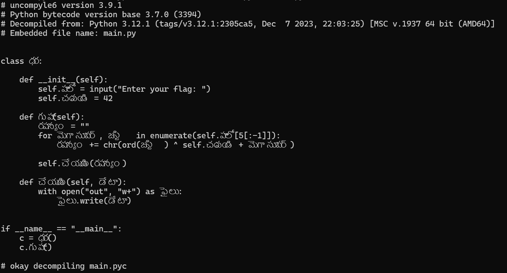
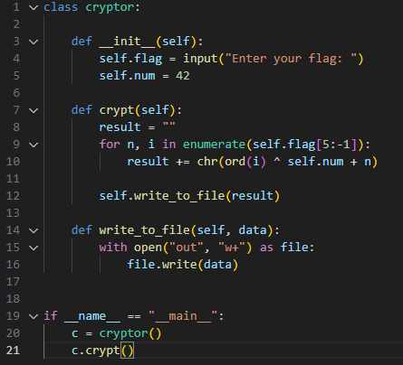

# small crypto

---

1. Можем попытаться закинуть файл в `IDA` или `ghidra`, но это нам ничего не даст. `strings` тоже не даёт результата
2. Открыв файл в хексе или в той же гидре, можно найти упоминая `py` файлов. Попробуем закинуть файл в `pyinstxtractor`.
3. Получили скомпилированные файлы питона в формате `pyc`
4. Если нам повезёт и при их компиляции использовался питон версии меньше `3.9`, то мы можем декомпилировать их с помощью `uncompyle6`
5. Нас интересует файл `main.py`. Получаем кол, но он обфуцированн 

6. Деобфуцируем код и правим ошибку в срезе                                                          

7. Видим тут легчайший шифратор, где просто каждый символ ксорится на `(42 + позиция символа в троке)`
8. Пример решение на Python.
```python
class cryptor:

    def __init__(self):
        self.num = 42

    def decrypt(self):
        with open('out') as file:
            enc_flag = file.read()
        result = ""
        for n, i in enumerate(enc_flag):
            result += chr(ord(i) ^ self.num + n)
        print(f'w33k{{{result}}}')


if __name__ == "__main__":
    c = cryptor()
    c.decrypt()
```

**Флаг** `w33k{7c9b2b5f374b5a0158e7d31175713880bfcc232d9259634f69e0a4517a828a46}`
