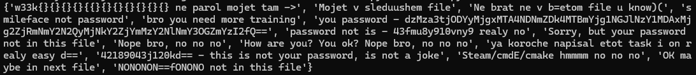

# a needle in a havestack

---

1. Разархивируем и видим что в папке ещё куча папок, углубляемся и находим файл. Но в файте пароля нет.
2. Напишем скприпт на Python, который переберёт все файлы и выведет нам уникальные значения
```python
import os

havstack = r'havstack' # путь до папки

file_data = []

for root, dirs, files in os.walk(havstack):
    for file in files:
        file_path = os.path.join(root, file)
        with open(file_path) as f:
            file_data.append(f.readline())

print(set(file_data))
```
3. Получили такой результат, видим строчку `you password - dzMza3tjODYyMjgxMTA4NDNmZDk4MTBmYjg1NGJlNzY1MDAxMjg2ZjRmNmY2N2QyMjNkY2ZjYmMzY2NlNmY3OGZmYzI2fQ==`

4. Суём в `base64decoder` и забираем флаг

**Флаг** `w33k{c86228110843fd9810fb854be765001286f4f6f67d223dcfcbc3cce6f78ffc26}`
