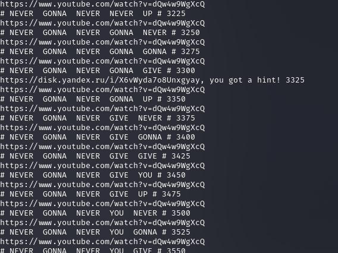
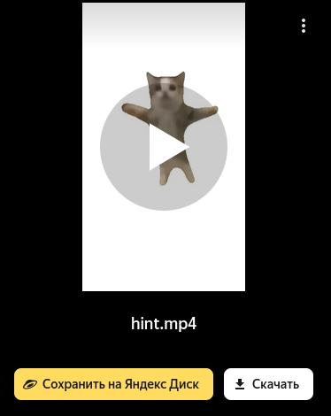
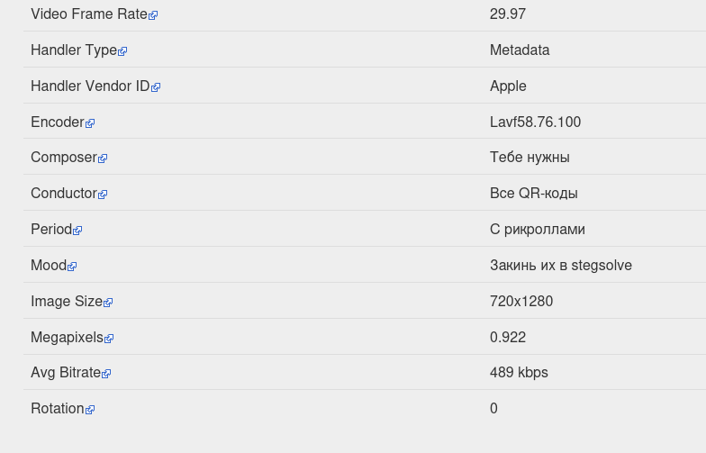
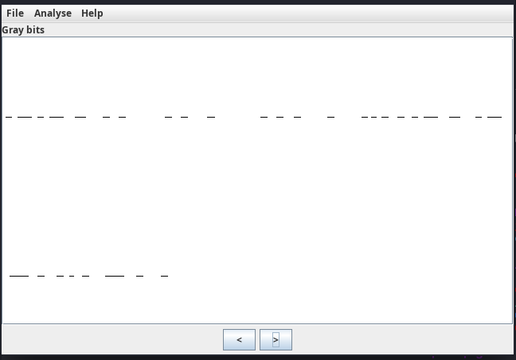
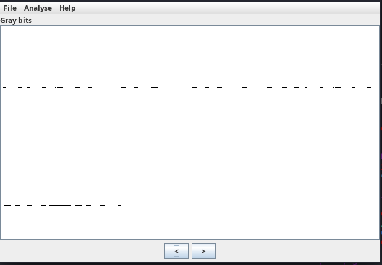
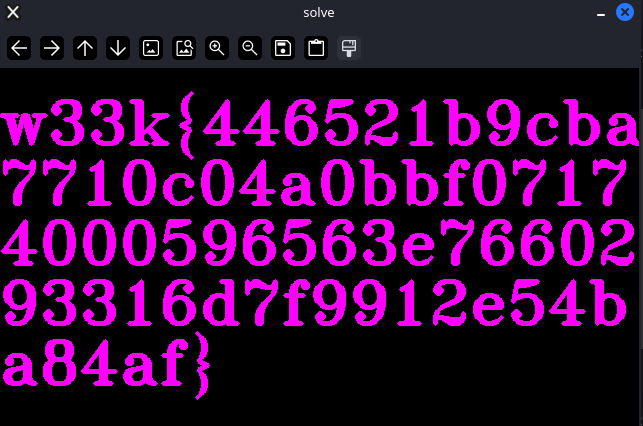

# RickR0lll

---

Ну и это моя любимая таска венец творения вишенка на торте - мега вкуснятина если понимаете о чем я :smirking_face:

В архиве лежит огромный такой avi файл а в нем Rick Ashley - Never Gonna Give You Up! Мелькают qr-ы их много...

Используем opencv и qrcode чтобы вынуть коды и прочитать их (только не говорите что вы покадрово листали и сканили с телефона :melting_face:)

Авторский пример:

```
import cv2

cap=cv2.VideoCapture('R1ckR0ll.avi')
success, frame =cap.read()
qcd=cv2.QRCodeDetector()
i=0;
while True:
    decoded, points, _ =qcd.detectAndDecode(frame)
    success, frame =cap.read()
    if points is not None and len(decoded)>1:print(decoded,i)
    i+=1
```

Вывод проги:



Как видно из текстов большая часть - ссылки на оригинал с приписками NEVER GONNA GIVE YOU UP и их перестановкой. Но есть один особый)))

`https://disk.yandex.ru/i/X6vWyda7o8Unxgyay, you got a hint!`

Переходим по ссылке и получаем хинт(тут главное было понять что приприска yay это как бы часть мессеги вам а не ссылка)



Радуемся и... кидаем это куда нить например на сайт exif.tools, или просто смотрим в свойства там хинт))



Ага, нужны все qrкоды 0_0 что это значит??

Теперь уже вынимаем первые 2-4 qr кода и смотрим на них со всех сторон (Ну не зря же видео такое толстенькое а qr такие качественные)

И в stegsolve мы на паре plane'ов видим это:



 :face_with_peeking_eyes: что это??? Откроем четвертый:



и тд. пока не выясним что они двигаются как строчки в телевизоре, так вот что значил хинт! :magnifying_glass_tilted_right:

Напомню что qr - каждый 25 кадр, а расстояние между 2 линиями 100 пикселей - следовательно нужно всего 100 кодов

Собираем картинку нехитрым скриптом:

```
import cv2
import numpy as np

cap=cv2.VideoCapture('R1ckR0ll.avi')
success, frame =cap.read()
qcd=cv2.QRCodeDetector()
sol=np.zeros(frame.shape)
i=0;
for i in range(2500):
    if i%25==0:
        sol+=frame<<7
    success, frame =cap.read()
    i+=1

cv2.imshow("solve",sol)
cv2.waitKey(5000)
```


**флаг** w33k{446521b9cba7710c04a0bbf07174000596563e7660293316d7f9912e54ba84af}
