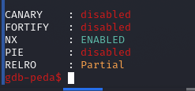
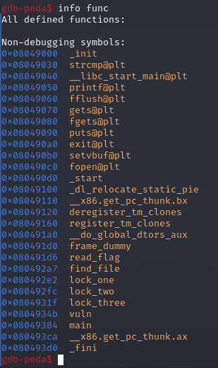
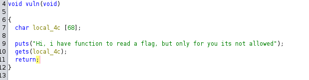
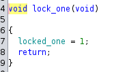
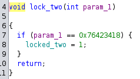
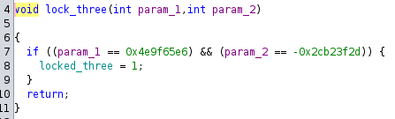
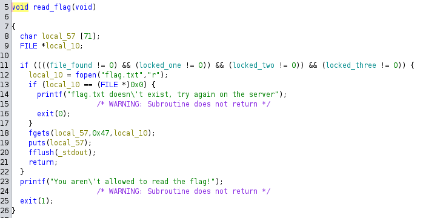
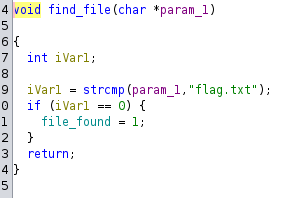

# Верёвочки

---

Сразу из описания дается намек на то что надо использовать rop(returned orientiered programming)


Запулив бинарь в gdb-peda видим следующее

Защиты(checksec):



Функции(info func):



Ага! Интересные функции find_file, lock_one, lock_two, lock_three, read_flag и vuln!

Покрутив туда-сюда в ghidra выясняется что бинарь из себя представляет

vuln()



lock_one()



lock_two()



lock_three()



read_flag()



find_file()




агаа надо запустить функцию read_flag но чтобы она выдала флаг надо открыть все локи, чтобы она открыла локи надо пройтись по всем функам и пооткрывать их:

схема пейлода такова rop find_file() -> rop lock_one -> rop  lock_two + параметр -> rop lock_three + 2 параметра -> read_flag()


~~Счиатем  оффсетики~~ (это для жеских калачей) Закидываем бинарь в pwntools и просим его найти все оффсеты, собираем пейлоад:

```

```
Ну и запускаем

